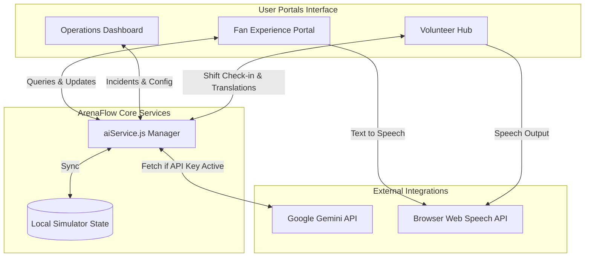
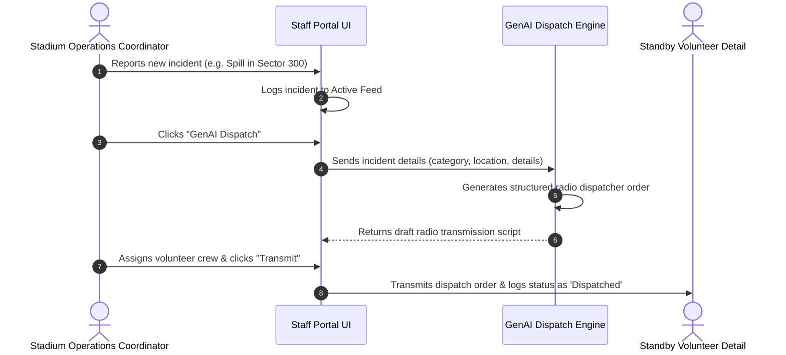
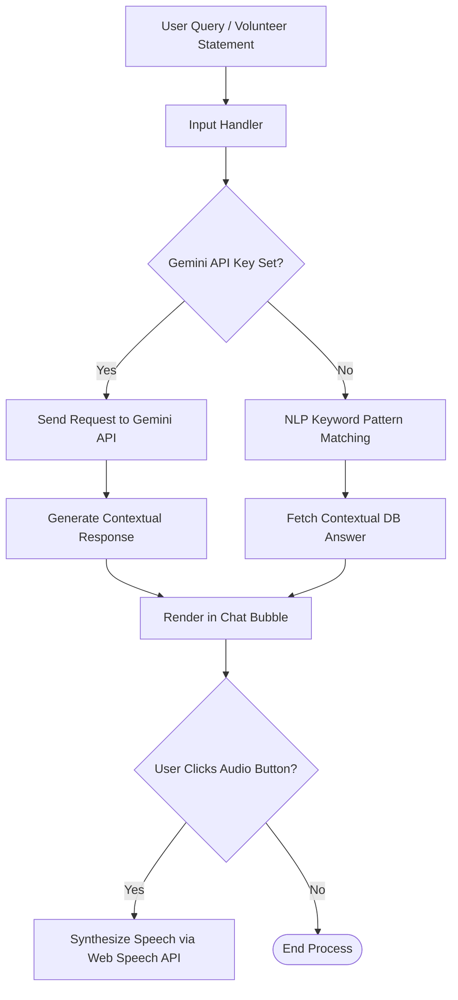

# ArenaFlow 360: FIFA World Cup 2026 Smart Stadiums & Tournament Operations Hub

ArenaFlow 360 is a premium, GenAI-enabled web application designed to optimize stadium logistics, volunteer coordination, and fan experiences during the FIFA World Cup 2026 (customized for MetLife Stadium host venue). It features distinct portals for three main personas: Fans, Venue Staff & Organizers, and Volunteers.

---

## 🏆 Key Features

### 1. Fan Experience Portal
*   **GenAI Match Day Companion**: Multilingual chatbot supporting queries about ticketing, security clear-bag policies, restrooms, transport hubs, and food locations with built-in Text-To-Speech (TTS) audio playback.
*   **Interactive Stadium Explorer**: A custom vector SVG map detailing section wait times, crowd density indices, and simulated Seat View Previews with nearby accessibility guides.
*   **Smart Mobility Hub**: Real-time traffic, parking lot capacities, and train shuttle wait times.

### 2. Operations & Organizers Dashboard
*   **Live Control Tower Metrics**: Displays total attendance, open incidents, staff capacity, and warning congestion indices.
*   **Recharts Entry Analytics**: Interactive area charts comparing ticket entry flow rates vs Gate capacity safety limits.
*   **GenAI Dispatch Engine**: Automatically parses reported incident details and drafts appropriate emergency or maintenance radio scripts for dispatch.
*   **Operations Oracle**: A context-aware operations guidelines lookup tool.

### 3. Volunteer Hub
*   **Check-In Simulation**: Allows field helpers to check-in for shifts and generates a dynamic digital QR Entry Pass.
*   **GenAI Multilingual Translation Toolkit**: Instantly translates statements between English and Spanish, French, German, Arabic, Japanese, or Portuguese, featuring voice announcement capabilities to greet international fans.
*   **Shift Guidelines**: Active checklist tracking security and service parameters.

---

## 📊 System Architecture & Workflows

### 1. High-Level System Architecture
The application runs as a modular single-page React app. The `aiService` coordinates the simulated database states and routes chat queries either to the Gemini API or the local context-aware NLP parser.



### 2. GenAI Incident Dispatcher Workflow
This diagram illustrates the automated sequence when a stadium incident is reported, drafted into emergency instructions by the GenAI dispatch engine, and transmitted to volunteers.



### 3. Multilingual AI Assistant Routing
This diagram outlines how queries in the Fan Chatbot and Volunteer Translator are routed and processed.



---

## 🚀 Running Locally

### Prerequisites
*   **Node.js**: v20 or later
*   **npm**: v10 or later

### Installation & Run Commands
1. Clone this repository (or copy folders).
2. Install the node packages:
    ```bash
    npm install
    ```
3. Run the local development server:
    ```bash
    npm run dev
    ```
4. Access the server at `http://localhost:5173/` in your browser.

### Enabling Real Gemini AI Responses
1. Open the website in your browser.
2. Click the **Developer Controls** cog icon in the bottom-right.
3. Enter your **Google Gemini API Key** and click **Save**. 
4. The Fan Companion, Global Assistant, and Operations Oracle will now generate live GenAI answers.
